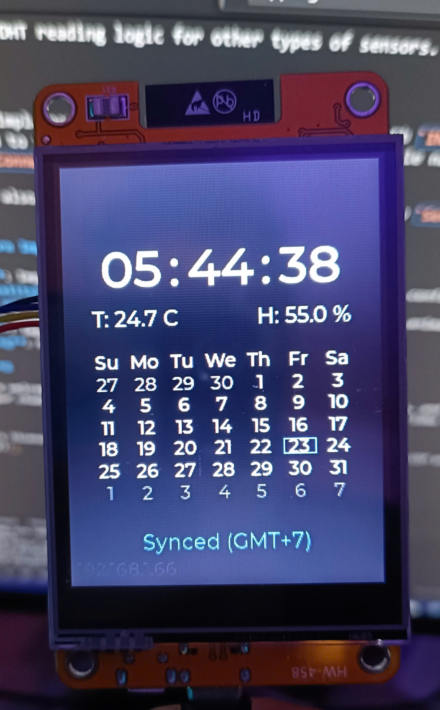

# ESP32 NTP Clock with LVGL and DHT11 Sensor

An ESP32-based clock that displays time synchronized via NTP, along with temperature and humidity from a DHT11 sensor, on a TFT display using the LVGL library. This project is specifically tailored for the popular **ESP32-2432S028R** development board (often referred to as the "Cheap Yellow Display" or CYD).



## Table of Contents

- [ESP32 NTP Clock with LVGL and DHT11 Sensor](#esp32-ntp-clock-with-lvgl-and-dht11-sensor)
  - [Table of Contents](#table-of-contents)
  - [1. Overview](#1-overview)
  - [2. Features](#2-features)
  - [3. Hardware Requirements](#3-hardware-requirements)
  - [4. Prerequisites](#4-prerequisites)
  - [5. Software Libraries \& Dependencies](#5-software-libraries--dependencies)
  - [6. Configuration](#6-configuration)
  - [7. Getting Started](#7-getting-started)
    - [Cloning the Repository](#cloning-the-repository)
    - [Building and Uploading](#building-and-uploading)
  - [8. Project Structure and Core Logic](#8-project-structure-and-core-logic)
    - [Main Classes:](#main-classes)
    - [FreeRTOS Tasks:](#freertos-tasks)
    - [Main Workflow (`setup()` and `loop()`):](#main-workflow-setup-and-loop)
  - [9. Customization](#9-customization)
  - [10. Logging](#10-logging)
  - [11. Potential Future Improvements](#11-potential-future-improvements)
  - [12. Contributing](#12-contributing)
  - [13. License](#13-license)

## 1. Overview

This project implements a feature-rich digital clock on an ESP32 microcontroller. It fetches time from NTP servers, displays it on a TFT screen using the LVGL graphics library, and also shows current temperature and humidity readings from a DHT11 sensor. The application utilizes FreeRTOS for task management, ensuring smooth UI rendering and concurrent network operations.

## 2. Features

*   **Accurate Timekeeping**: Synchronizes with multiple NTP servers to display precise time (GMT+7 configured by default).
*   **Graphical User Interface (GUI)**: Uses LVGL to render a modern-looking clock face, calendar, and status indicators on a TFT display.
    *   Displays hours, minutes, and seconds.
    *   Blinking colons between time units.
    *   Full calendar display (month/year) with the current day highlighted.
*   **Sensor Data Display**: Integrates with a DHT11 sensor to display real-time temperature (Celsius) and humidity (%).
*   **WiFi Connectivity**: Connects to a specified WiFi network to access NTP servers.
    *   Displays current IP address.
    *   Shows WiFi connection status.
    *   Handles connection retries.
*   **NTP Status**: Indicates the status of NTP synchronization (e.g., "Syncing...", "Synced", "NTP Fail").
*   **Robust Operation**:
    *   Uses FreeRTOS tasks for dedicated LVGL handling and network/time management.
    *   Mutex for thread-safe LVGL operations.
    *   Iterates through a list of NTP servers for redundancy.
    *   Periodic NTP re-synchronization.
    *   Automatic WiFi reconnection attempts.
*   **Custom Logging**: Simple application-level logger for INFO, WARN, and ERROR messages via Serial output.
*   **Touchscreen Support**: Basic framework for touchpad input.

## 3. Hardware Requirements

*   **ESP32 Development Board**: This project is designed for the **ESP32-2432S028R** (Cheap Yellow Display/CYD). This board integrates:
    *   An ESP32-WROOM-32 module.
    *   A 2.8-inch TFT LCD (240x320 resolution) typically using an **ILI9341 driver**.
    *   A resistive touchscreen, commonly with an **XPT2046 controller**.
    *   An SD card slot (not used in this project).
    *   An RGB LED (not used in this project).
*   **DHT11 Temperature and Humidity Sensor**.
*   **Appropriate Wiring**: For the DHT11 sensor, connect its data pin to the GPIO specified in the configuration (default GPIO27), VCC to 3.3V, and GND to ground. The display and touch are pre-wired on the ESP32-2432S028R board.

## 4. Prerequisites

*   **PlatformIO IDE**: This project is intended to be built using [PlatformIO](https://platformio.org/). Installation instructions can be found on their website. It can be used as a VS Code extension or as a Core CLI.
*   **Serial Monitor**: A serial monitor program (like the one built into PlatformIO or Arduino IDE) to view logs.

## 5. Software Libraries & Dependencies

The project is built using the Arduino framework for ESP32. PlatformIO will automatically manage and install the following key libraries based on the `platformio.ini` configuration (not provided here, but assumed to list these):

*   `Arduino.h`: Core Arduino framework.
*   `WiFi.h`: For ESP32 WiFi connectivity.
*   `time.h`: Standard C library for time functions.
*   `NTPClient.h` (e.g., by Fabrice Weinberg): For interacting with NTP servers.
*   `WiFiUdp.h`: For UDP communication required by NTP.
*   `TFT_eSPI.h` (by Bodmer): Driver for the TFT display. **Requires user configuration.**
*   `lvgl.h` (e.g., version 8.x): Light and Versatile Graphics Library for the UI. **Requires user configuration.**
*   `DHT.h` (e.g., by Adafruit): Library for reading data from DHT series sensors.
*   `std::vector`, `std::stdarg`: Standard C++ libraries.

**Important:**
*   **TFT_eSPI Configuration**: You will need to configure `TFT_eSPI` by creating/editing a `User_Setup.h` file within the `TFT_eSPI` library folder (usually in `.pio/libdeps/<env_name>/TFT_eSPI/`). For the ESP32-2432S028R, specific `User_Setup.h` files are often available online (e.g., from projects like the one by witnessmenow on GitHub or RandomNerdTutorials). These pre-configured files correctly define the ILI9341 driver and the specific SPI pins used by the board for the display and the XPT2046 touch controller.
*   **LVGL Configuration**: LVGL is typically configured via an `lv_conf.h` file. This project's `src/lv_conf.h` should be used by LVGL. Ensure it is correctly picked up by the LVGL library, often by placing it in the LVGL library's root directory or by including it appropriately. PlatformIO library management settings might influence this.

## 6. Configuration

Key application parameters can be configured directly in `src/main.cpp`:

```cpp
// --- Hằng số cấu hình ---
const char* WIFI_SSID = "YOUR_WIFI_SSID";        // SSID WiFi của bạn
const char* WIFI_PASSWORD = "YOUR_WIFI_PASSWORD";  // Mật khẩu WiFi của bạn
const std::vector<const char*> NTP_SERVER_LIST = {
    "0.vn.pool.ntp.org", "1.vn.pool.ntp.org", /* ... more servers ... */
};
constexpr int SCREEN_WIDTH  = 240;
constexpr int SCREEN_HEIGHT = 320;

// Cấu hình cảm biến DHT
#define DHTPIN 27     // Chân kỹ thuật số kết nối với cảm biến DHT (ESP32 GPIO27)
#define DHTTYPE DHT11   // Loại cảm biến DHT 11
// ... other constants ...
```

*   **WiFi Credentials**:
    *   `WIFI_SSID`: Your WiFi network name.
    *   `WIFI_PASSWORD`: Your WiFi password.
*   **NTP Servers**:
    *   `NTP_SERVER_LIST`: A `std::vector` of NTP server hostnames. Modify this list to use servers closer to your location or preferred ones.
*   **Screen Dimensions**:
    *   `SCREEN_WIDTH`: Default is 240 pixels.
    *   `SCREEN_HEIGHT`: Default is 320 pixels.
*   **DHT Sensor**:
    *   `DHTPIN`: GPIO pin connected to the DHT11 sensor's data line (default: `27` on ESP32-2432S028R).
    *   `DHTTYPE`: Sensor type (default: `DHT11`).
    *   `DHT_READ_INTERVAL_MS`: Interval for reading sensor data.
*   **LVGL Tick Period**:
    *   `LVGL_TICK_PERIOD_MS`: Defines how often LVGL's internal ticker is called.
*   **Timezone Offset**: The code applies a GMT+7 offset in `UIManager::update_time_display_labels`:
    ```cpp
    raw_time_utc_val += 7 * 3600; // Adjust for GMT+7
    ```
    Modify this value for your local timezone.

## 7. Getting Started

### Cloning the Repository

```bash
git clone https://your-repository-url/esp32-clock.git
cd esp32-clock
```
Replace `https://your-repository-url/esp32-clock.git` with the actual URL of this repository.

### Building and Uploading

1.  **Open in PlatformIO**: Open the cloned project folder in VS Code with the PlatformIO IDE extension installed, or navigate to it in your terminal if using PlatformIO Core.
2.  **Configure Libraries**:
    *   Ensure `TFT_eSPI` is configured for your specific display and pin connections. See the "Software Libraries & Dependencies" section for details on `User_Setup.h`.
    *   Verify `lv_conf.h` from the `src` directory is correctly used by LVGL.
3.  **Modify `src/main.cpp`**: Update WiFi credentials, NTP servers, and other configurations as described in the "Configuration" section.
4.  **Build**: Use the PlatformIO "Build" command (usually a checkmark icon in VS Code status bar or `pio run` in the terminal).
5.  **Upload**: Connect your ESP32 board. Use the PlatformIO "Upload" command (usually an arrow icon or `pio run --target upload`).
6.  **Monitor**: Open the PlatformIO Serial Monitor (usually a plug icon or `pio device monitor`) to view log output and debug information.

## 8. Project Structure and Core Logic

The application is structured into several C++ classes and utilizes FreeRTOS tasks for concurrency.

### Main Classes:

*   **`DisplayManager`**: Initializes the TFT, sets up LVGL display drivers, and input (touchpad) drivers.
*   **`UIManager`**: Manages all LVGL UI elements (time, date, sensor data, status, calendar), styles, layout, and provides update methods.
*   **`NetworkManager`**: Handles WiFi connection logic and status checking.
*   **`TimeManager`**: Manages `NTPClient`, performs time synchronization, and provides current UTC time.

### FreeRTOS Tasks:

*   **`lvgl_task_handler_rtos` (Core 0)**: Dedicated task for LVGL operations, calling `lv_tick_inc()` and `lv_timer_handler()` periodically, protected by a mutex.
*   **`network_time_task_handler_rtos` (Core 1)**: Handles WiFi connection, initial and periodic NTP sync, and WiFi reconnection.

### Main Workflow (`setup()` and `loop()`):

*   **`setup()`**: Initializes serial, DHT, LVGL mutex, `DisplayManager`, `UIManager` (styles and UI creation), and creates the FreeRTOS tasks pinned to specific cores.
*   **`loop()`**: The main Arduino loop is kept lean. It primarily handles:
    *   Periodically updating the time display if NTP is synced.
    *   Periodically reading and updating DHT sensor data.
    *   Includes a `vTaskDelay` to yield processing to other tasks.

## 9. Customization

*   **UI Elements**: Modify the `UIManager::create_ui()` method to change the layout, add, or remove LVGL widgets.
*   **Styles**: Adjust `UIManager::init_styles_static()` to change fonts, colors, and appearances.
*   **Logic**: Extend `TimeManager` for different time sources or `NetworkManager` for other network protocols.
*   **Sensor**: Adapt the DHT reading logic for other types of sensors.

## 10. Logging

The project includes a simple namespaced logging utility `AppLog` with `INFO`, `WARN`, and `ERROR` levels. Logs are printed to the Serial monitor, prefixed with the module name and log level.
Example: `[WiFi][INFO] Connected. IP: 192.168.1.100`

LVGL's own logging can also be enabled via `lv_conf.h` and will print to `Serial.print` as configured in `main.cpp`.

## 11. Potential Future Improvements

*   **Settings Menu**: Implement a touch-based settings menu for on-device configuration.
*   **Alarm Functionality**: Add alarms with UI integration.
*   **More Advanced UI**: Explore more LVGL features for richer graphics or animations.
*   **OTA Updates**: Integrate Over-The-Air firmware update capabilities.
*   **Power Saving**: Implement power-saving modes.
*   **Error Handling**: More granular error display on the UI.

## 12. Contributing

Contributions are welcome! Please feel free to fork the repository, make changes, and submit a pull request. For major changes, please open an issue first to discuss what you would like to change.

## 13. License

This project is licensed under the MIT License. See the `LICENSE` file for details (if one is added to the repository). 